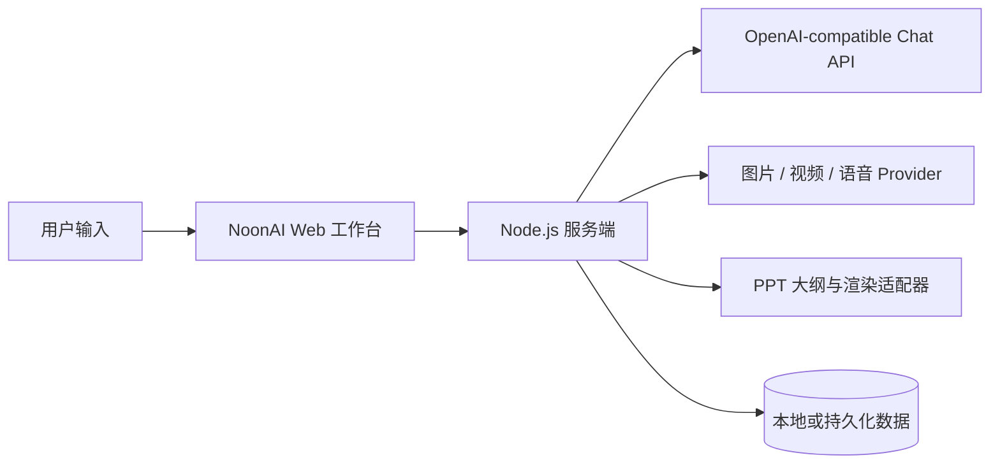

<div align="center">
  <p></p>

  # NoonAI

  **一个面向创作者与独立开发者的开源 AI 工作台**

  从对话、图片与内容创作，到 PPT、模型测评和 AI 漫剧，把高频 AI 工作流放进一个可扩展的 Node.js 应用。

  <p>
    <a href="#快速开始">快速开始</a> ·
    <a href="#功能总览">功能总览</a> ·
    <a href="#项目结构">项目结构</a> ·
    <a href="#部署">部署</a>
  </p>

  <p>
    
    
    
    
  </p>
</div>


> NoonAI 不只是一个聊天页面。它把模型调用、创作工具、评测方法和可继续扩展的应用入口组合成一个个人 AI 工作台。

> **发布提示**：README 中的视觉素材来自 `public/` 目录。发布到 GitHub 时需要连同 `public/` 一起提交，否则图片会显示为裂图。

## 为什么是 NoonAI

很多 AI 产品只解决一次问答；真实工作却往往需要连续的上下文、文件与素材、可复用的工作流，以及可以检查的结果。NoonAI 的目标是把这些步骤放在同一个工作空间里：

- **统一入口**：聊天、图片生成、PPT、AI 漫剧、模型测评等能力共享同一套应用壳。
- **模型可替换**：通过 OpenAI-compatible API 接入不同供应商和模型，不把前端锁死在单一服务商上。
- **创作导向**：围绕脚本、画面、演示文稿和音频等内容生产任务组织交互。
- **服务端保密**：API key 只在 Node.js 服务端读取，浏览器端不接触密钥。
- **便于二次开发**：原生 Node.js + HTML/CSS/JavaScript，无大型框架依赖，适合个人部署和功能实验。

## 功能总览

### 1. AI 对话工作台


#### ChatGPT 风格交互

支持多模型选择、流式输出、停止生成、重新生成、复制、点赞/点踩、会话搜索与本地历史。


#### 多模态创作入口

对接 OpenAI-compatible 聊天与图片生成接口，并为视频、语音、联网搜索和文件能力保留扩展位。

### 2. PPT Studio


PPT Studio 是一个从需求到演示结构的工作流，而不是简单的文本生成器：

- **智能生成 / 粘贴内容 / 导入资料** 三种起始模式。
- 可设置页数、语言、受众、画幅比例和证据处理方式。
- 选择真实模板资产，或交给 AI 推荐风格。
- 先审阅结构化大纲，再交给独立的 PPTX 渲染服务。
- 通过 `PPT_RENDER_API_URL` 解耦模板继承、渲染和视觉 QA。

入口：`http://localhost:3000/ppt/`

### 3. AI 漫剧工厂


面向短剧和连续剧创作，提供剧本分析、分集规划、角色锁定、连续性检查、系列资产管理和批量生成等工作流入口。

入口：`http://localhost:3000/ai-drama/`

### 4. 模型测评

基于 AIX-144 题集和统一评分标准，对模型的逻辑、推理、知识、创造力、安全等能力进行结构化评估，并保存可归档报告。

入口：`http://localhost:3000/model-test/`

### 5. 其他工作台

| 应用 | 用途 | 状态 |
| --- | --- | --- |
| 活字印刷机 | 音频素材与发音拼接工作流 | 已接入入口 |
| AI 剪辑 | 视频创作入口 | 规划中 |
| 图片生成 | 文生图与生成结果管理 | 已接入 |
| 账号系统 | 手机号登录、密码/验证码、用户数据隔离 | 可部署 |

## 快速开始

### 环境要求

- Node.js `20+`
- 一个 OpenAI-compatible API 服务
- Windows、macOS 或 Linux

### 安装与启动

```bash
git clone <YOUR_GITHUB_REPOSITORY_URL>
cd noonai
npm install
cp .env.example .env
npm start
```

Windows PowerShell 也可以使用项目内置脚本配置本地 key：

```powershell
.\set-openai-key.ps1
npm start
```

启动后打开：

```text
http://localhost:3000
```

健康检查：

```text
http://localhost:3000/api/health
```

### 最小配置

复制 `.env.example` 后，至少配置以下变量：

```env
OPENAI_BASE_URL=https://api.openai.com/v1
OPENAI_API_KEY=replace-me
OPENAI_MODEL=gpt-5.5
OPENAI_IMAGE_MODEL=gpt-image-2
PORT=3000
```

PPT Studio 的大纲规划和 PPTX 渲染可以单独配置：

```env
PPT_OPENAI_BASE_URL=https://api.openai.com/v1
PPT_OPENAI_API_KEY=replace-me
PPT_OPENAI_MODEL=gpt-5.4
PPT_RENDER_API_URL=https://your-ppt-renderer.example/v1/render
PPT_RENDER_API_KEY=replace-me
```

> 不要把真实 key 写入 `public/`、前端代码、README 或 Git 历史。`.env` 已被 `.gitignore` 排除；生产环境请使用部署平台的加密环境变量。

## 工作方式



核心原则：浏览器负责交互，服务端负责鉴权、密钥、模型路由、文件与结果代理；外部能力通过环境变量和适配器接入。

## 项目结构

```text
noonai/
├─ server.js                 # Node.js HTTP 服务、API 路由与模型适配
├─ auth.js                   # 账号、会话与用户数据隔离
├─ public/
│  ├─ index.html             # NoonAI 主工作台
│  ├─ app.js                 # 主界面交互
│  ├─ ppt/                   # PPT Studio
│  ├─ ai-drama/              # AI 漫剧工厂
│  ├─ model-test/            # AIX-144 模型测评
│  └─ letterpress/           # 活字印刷机
├─ skills/sandy-ppt-design/  # PPT 生成与质量检查方法
├─ tests/                    # 自动化测试
├─ .env.example              # 环境变量模板
├─ PPT-PRD.md                # PPT 产品规格
└─ PPT-API-Contract.md       # PPT API 契约
```

## 开发与验证

```bash
# 启动开发服务
npm run dev

# 运行 PPT Studio 聚焦测试
npm run test:ppt
```

PPT 测试会检查三种创建模式、六个真实模板预览、前后端接口和前端源码中的密钥泄露风险。

## 部署

NoonAI 是常规 Node.js 服务，适合部署到 Render、Railway、Fly.io 或其他支持持久环境变量和 Node.js 进程的平台。

生产环境建议：

1. 使用 HTTPS，并通过平台 Secret 管理所有 API key。
2. 为 `DATA_DIR` 挂载持久磁盘；当前账号数据适合单实例 MVP。
3. 配置真实短信服务，不要在生产环境使用 `SMS_PROVIDER=console`。
4. 多实例部署前，将 JSON 数据存储迁移到 PostgreSQL 或 MySQL。
5. PPTX 渲染服务单独部署，并按 `PPT-API-Contract.md` 对接。

更多账号部署说明见 [`AUTH_DEPLOYMENT.md`](AUTH_DEPLOYMENT.md)。

## 当前边界与路线图

- [x] 多模型聊天与 OpenAI-compatible 路由
- [x] 图片生成入口与结果管理
- [x] PPT Studio 大纲规划、真实模板选择和渲染适配器
- [x] AI 漫剧创作工作流入口
- [x] AIX-144 模型测评与报告归档
- [x] 手机号账号系统和用户数据隔离
- [ ] Node 进程内原生继承模板并渲染 PPTX
- [ ] PDF / DOCX / PPTX 的完整源文件解析
- [ ] 跨设备项目历史、协作与团队权限
- [ ] 计费、额度与模板市场

## 参与贡献

欢迎提交 Issue、功能建议和 Pull Request。建议在提交前：

1. 先阅读相关 PRD、Tech Spec 或 API Contract。
2. 保持改动聚焦，不提交 `.env`、API key 和本地数据。
3. 运行最窄范围的相关测试，并在 PR 中说明验证结果。

## English Summary

NoonAI is an open-source AI workspace for creators and indie developers. It combines an OpenAI-compatible chat interface, image generation, PPT planning, AI drama workflows, and structured model evaluation in a lightweight Node.js application. API keys stay on the server, while model providers and rendering services are connected through environment-driven adapters.

Repository URL: `<YOUR_GITHUB_REPOSITORY_URL>`
